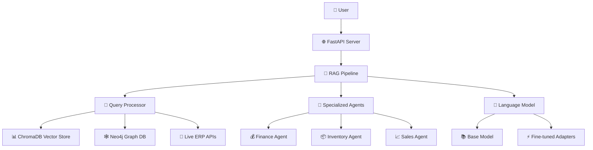
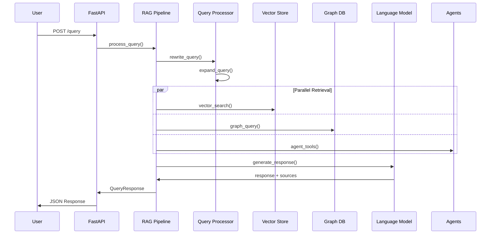
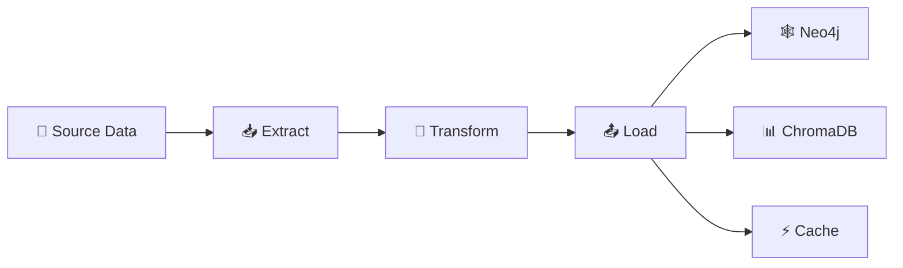

# 🏗️ Architecture Documentation

## Tổng quan kiến trúc

ERP AI Pro Version được thiết kế theo kiến trúc **Multi-Agent RAG Pipeline** với các thành phần được tách biệt rõ ràng, cho phép mở rộng và bảo trì dễ dàng.

## 📐 Kiến trúc tổng thể



## 🏛️ Layered Architecture

### 1. Presentation Layer
- **FastAPI Application** (`main.py`)
  - RESTful API endpoints
  - Request/Response models với Pydantic
  - Async request handling
  - Health checks và monitoring

### 2. Business Logic Layer
- **RAG Pipeline** (`erp_ai_core/rag_pipeline.py`)
  - Query orchestration
  - Multi-agent coordination
  - Role-based access control
  - Error handling và retry logic

- **Specialized Agents**
  - **Finance Agent** (`agent_finance.py`): Tài chính, báo cáo, công nợ
  - **Inventory Agent** (`agent_inventory.py`): Quản lý kho, tồn kho
  - **Sales Agent** (`agent_sales.py`): Bán hàng, đơn hàng, khách hàng

### 3. Data Layer
- **Vector Store** (ChromaDB): Unstructured knowledge
- **Graph Database** (Neo4j): Structured relationships
- **Live APIs**: Real-time ERP data
- **File Storage**: Local/cloud file systems

### 4. Infrastructure Layer
- **Containerization**: Docker
- **Orchestration**: Kubernetes (EKS)
- **IaC**: Terraform
- **Monitoring**: Health checks, logging

## 🔄 Data Flow Architecture

### Query Processing Flow



## 🎯 Component Details

### RAG Pipeline Components

#### 1. Query Enhancement
```python
class QueryProcessor:
    - query_rewriting: Paraphrase câu hỏi
    - query_expansion: Mở rộng từ khóa
    - intent_detection: Phân loại mục đích
```

#### 2. Multi-Modal Retrieval
```python
class HybridRetriever:
    - vector_search: Semantic similarity trong ChromaDB
    - graph_traversal: Entity relationships trong Neo4j
    - api_calls: Real-time data từ ERP systems
```

#### 3. Re-ranking System
```python
class ReRanker:
    - relevance_scoring: Cross-encoder models
    - context_filtering: Lọc theo role và context
    - source_prioritization: Ưu tiên nguồn tin cậy
```

#### 4. Response Generation
```python
class ResponseGenerator:
    - context_injection: Thêm retrieved context
    - role_adaptation: Điều chỉnh theo user role
    - source_citation: Trích dẫn nguồn
```

### Agent Architecture

#### Finance Agent
```python
class FinanceAgent:
    tools:
        - get_revenue_report()
        - get_expense_report()
        - get_customer_debt()
        - create_receipt()
        - create_payment()
    
    capabilities:
        - Financial reporting
        - Debt management
        - Payment processing
```

#### Inventory Agent
```python
class InventoryAgent:
    tools:
        - get_inventory_overview()
        - stock_in()
        - stock_out()
        - inventory_check()
        - get_low_stock_alerts()
    
    capabilities:
        - Stock management
        - Warehouse operations
        - Alert systems
```

#### Sales Agent
```python
class SalesAgent:
    tools:
        - get_product_stock_level()
        - create_order()
        - get_order_status()
        - get_customer_outstanding_balance()
    
    capabilities:
        - Order management
        - Customer service
        - Sales analytics
```

## 🔒 Security Architecture

### Role-Based Access Control (RBAC)

```python
ROLE_TOOL_MAPPING = {
    "admin": ["all_tools"],
    "finance_manager": ["finance_tools", "reporting_tools"],
    "sales_rep": ["sales_tools", "customer_tools"],
    "warehouse_manager": ["inventory_tools", "stock_tools"],
    "analyst": ["reporting_tools", "calculation_tools"]
}
```

### Security Layers
1. **Authentication**: Bearer token validation
2. **Authorization**: Role-based tool access
3. **Data Filtering**: Role-specific data views
4. **Input Validation**: Pydantic model validation
5. **Error Handling**: Secure error messages

## 🚀 Scalability Considerations

### Horizontal Scaling
- **Stateless Design**: Không lưu trạng thái giữa requests
- **Load Balancing**: Multiple API instances
- **Database Sharding**: Phân tán dữ liệu
- **Caching Layers**: Redis cho frequently accessed data

### Performance Optimization
- **Model Caching**: Cache loaded models trong memory
- **Connection Pooling**: Database connection reuse
- **Async Processing**: Non-blocking I/O operations
- **Batch Processing**: Group operations cho efficiency

### Resource Management
- **Memory Management**: Efficient model loading
- **GPU Utilization**: Optimal device allocation
- **CPU Optimization**: Multi-threading cho I/O operations

## 🔧 Configuration Management

### Environment-based Config
```python
@dataclass
class RAGConfig:
    # Model Configuration
    base_model_name: str
    finetuned_model_path: str
    embedding_model_name: str
    
    # Database Configuration
    vector_store_path: str
    neo4j_uri: str
    
    # API Configuration
    erp_api_base_url: str
    api_timeout: int
    
    # Performance Configuration
    retrieval_k: int
    max_tokens: int
    temperature: float
```

### Runtime Configuration
- **Dynamic Tool Loading**: Based on user role
- **Model Switching**: Base vs fine-tuned models
- **Feature Flags**: Enable/disable experimental features

## 📊 Monitoring & Observability

### Application Metrics
- **Request Latency**: Response time tracking
- **Throughput**: Requests per second
- **Error Rates**: Failed request percentage
- **Resource Usage**: CPU, memory, GPU utilization

### Business Metrics
- **Query Success Rate**: Successful responses
- **User Satisfaction**: Response quality metrics
- **Tool Usage**: Agent tool utilization stats
- **Data Source Performance**: Retrieval efficiency

### Logging Strategy
```python
class LoggingConfig:
    levels:
        - DEBUG: Development debugging
        - INFO: General information
        - WARNING: Potential issues
        - ERROR: Error conditions
        - CRITICAL: System failures
    
    structured_logging:
        - JSON format
        - Contextual information
        - Correlation IDs
        - Performance metrics
```

## 🔄 Data Pipeline Architecture

### ETL Pipeline


### Data Sources
1. **CSV Files**: Customer, Product, Order, Employee data
2. **JSON Knowledge**: Procedures, policies, manuals
3. **Live APIs**: Real-time ERP system data
4. **File Uploads**: Documents, attachments

### Data Processing
1. **Extraction**: CSV parsing, API calls
2. **Transformation**: Data cleaning, validation, enrichment
3. **Loading**: Database insertion, index creation
4. **Validation**: Data quality checks

## 🎯 Future Architecture Considerations

### Planned Enhancements
- **Multi-language Support**: International deployment
- **Advanced Analytics**: ML-powered insights
- **Real-time Streaming**: Event-driven architecture
- **Mobile SDK**: Native mobile support

### Technology Evolution
- **Model Upgrades**: Latest LLM integration
- **Database Optimization**: Advanced indexing strategies
- **Cloud Migration**: Full cloud-native deployment
- **AI/ML Pipeline**: Automated model training/deployment