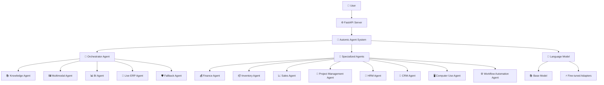
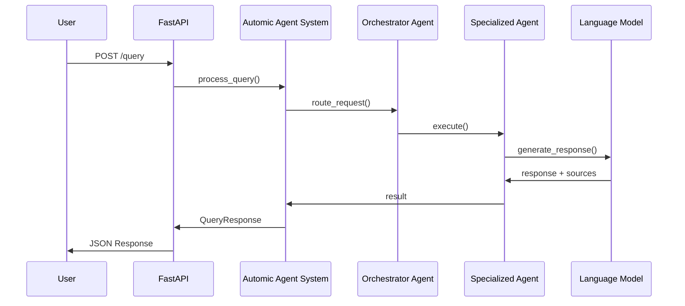

# 🏗️ ARCHITECTURE.md

## 🌐 Tổng quan kiến trúc

ERP AI Pro Version được thiết kế theo kiến trúc Multi-Agent Automic Agent Architecture với các thành phần tách biệt rõ ràng, cho phép mở rộng và bảo trì dễ dàng. Hệ thống hỗ trợ truy vấn ERP bằng ngôn ngữ tự nhiên, tích hợp sâu với các module nghiệp vụ, tối ưu cho doanh nghiệp Việt Nam.

---

## 1️⃣ Kiến trúc tổng thể

---

## 2️⃣ Layered Architecture

### 🖥️ Presentation Layer
- 🌐 **FastAPI Application** (`main.py`)
  - RESTful API endpoints
  - Request/Response models với Pydantic
  - Async request handling
  - Health checks & monitoring

### 🧠 Business Logic Layer
- 🤖 **Automic Agent System** (`erp_ai_pro/core/main_system.py`)
  - Orchestrator agent điều phối các agent chuyên biệt
  - Multi-agent coordination
  - Role-based access control
  - Error handling & retry logic
- 🧩 **Specialized Agents**
  - 💰 Finance, 📦 Inventory, 📈 Sales, 📅 Project Management, 👥 HRM, 🤝 CRM, 🖥️ Computer Use, ⚙️ Workflow Automation

### 🗄️ Data Layer
- 📊 **Vector Store** (ChromaDB): Unstructured knowledge
- 🕸️ **Graph Database** (Neo4j): Structured relationships
- 🔴 **Live APIs**: Real-time ERP data
- 🗂️ **File Storage**: Local/cloud file systems

### ⚙️ Infrastructure Layer
- 🐳 **Containerization**: Docker
- ☸️ **Orchestration**: Kubernetes (EKS)
- 🏗️ **IaC**: Terraform
- 📈 **Monitoring**: Health checks, logging

---

## 3️⃣ Luồng dữ liệu & Quy trình xử lý truy vấn

---

## 4️⃣ Thành phần chi tiết

### 🧩 Automic Agent System Components
- ✍️ **Query Enhancement**: rewriting, expansion, intent detection
- 🔍 **Hybrid Retrieval**: vector search (ChromaDB), graph traversal (Neo4j), API calls
- 🏅 **Re-ranking**: cross-encoder, context filtering, source prioritization
- 📝 **Response Generation**: context injection, role adaptation, source citation

### 🤖 Agent Ecosystem
- 💰 **Finance Agent**: Báo cáo doanh thu, chi phí, công nợ, thu/chi
- 📦 **Inventory Agent**: Tổng quan kho, nhập/xuất, cảnh báo tồn kho
- 📈 **Sales Agent**: Đơn hàng, khách hàng, trạng thái đơn
- 📅 **Project Management Agent**: Dự án, task, milestone, resource, risk
- 👥 **HRM Agent**: Nhân sự, tuyển dụng, lương, nghỉ phép, đánh giá
- 🤝 **CRM Agent**: Lead, opportunity, customer account, support, marketing
- 🖥️ **Computer Use Agent**: Tự động hóa UI, browser, báo cáo, nhập liệu
- ⚙️ **Workflow Automation Agent**: Tự động hóa quy trình, phê duyệt, workflow engine

### 🛠️ Công cụ hỗ trợ (tools.py)
- 📊 **Vector Search Tool**: Tìm kiếm semantic
- 🕸️ **Graph ERP Lookup**: Truy vấn Neo4j
- 🔴 **Live ERP API Tool**: Kết nối ERP API thời gian thực
- 📈 **Data Analysis Tool**: Tính toán, phân tích

---

## 5️⃣ Bảo mật & RBAC
- 🛡️ **Role-Based Access Control (RBAC)**: Mapping tool theo role trong rag_config.py
- 🔑 **Authentication**: Bearer token
- 🗝️ **Authorization**: Role-based tool access
- 🧹 **Data Filtering**: Role-specific data views
- 🧾 **Input Validation**: Pydantic
- 🚨 **Error Handling**: Secure error messages

---

## 6️⃣ Tối ưu hóa & Mở rộng
- 📈 **Horizontal Scaling**: Stateless, load balancing, sharding, caching
- ⚡ **Performance Optimization**: Model caching, connection pooling, async processing, batch processing
- 🧮 **Resource Management**: Memory, GPU, CPU
- ⚙️ **Configuration Management**: Environment-based config, dynamic tool loading, model switching, feature flags

---

## 7️⃣ Advanced Features & Roadmap
- 🌐 Multi-language support
- 📊 Advanced analytics dashboard
- 🔔 Real-time notifications
- 📱 Mobile API support
- 🏢 Distributed deployment
- 🧬 Model versioning system
- 🧪 A/B testing framework

---

## 8️⃣ Technical Stack (tóm tắt)
- 🐍 **Python 3.10+**, ⚡ **FastAPI**, 📊 **ChromaDB**, 🕸️ **Neo4j**, 🤗 **Transformers**, 🦾 **Unsloth**, 🐳 **Docker**, ☸️ **Kubernetes**, 🏗️ **Terraform**, 🔄 **CI/CD**

---

## 9️⃣ Kết luận

Kiến trúc ERP AI Pro Version đảm bảo tính module hóa, mở rộng, bảo mật, hiệu năng cao và sẵn sàng cho production, đáp ứng mọi nhu cầu nghiệp vụ và kỹ thuật của doanh nghiệp hiện đại.
